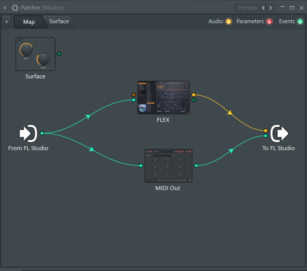

# PianoShooter v1.1.1

PianoShooter is a visualizer written for the [ZGameEditor](https://github.com/VilleKrumlinde/zgameeditor " ZGameEditor") Visualizer 
used in [FL Studio](http://image-line.com "FL Studio").

It displays a Piano-roll style keyboard and draws notes for MIDI events it receives.
- [Overview](#Overview)
- [Setup](#Setup)
- [Controls](#Controls)
- [Samples](#Samples)

## <a name="Overview"/>Overview

### Install with Impostorem Tools
As of version 1.1.1, PianoShooter is included in the [Impostorem Tools](https://github.com/devellison/impostorem_tools) installer.
If you are using it Windows 10 64-bit with FLStudio 20, you can just use the [Impostorem Tools Installer](https://github.com/devellison/impostorem_tools/releases).

### Manual Install
If you're not using the Impostorem Tools Installer, you can install PianoShooter manually.

To install PianoShooter, simply take the `PianoShooter.zgeobject` file and place it in the `Effects/Midi` directory 
for ZGameEditor Visualizer in FL Studio.

- On Windows, that will usually be `C:\Program Files (x86)\Image-Line\FL Studio\Plugins\Fruity\Effects\ZGameEditor Visualizer\Effects\Midi`.
- On Mac, it will usually be `/Applications/FL\ Studio\ 20.app/Contents/Resources/FL/Plugins/Fruity/Effects/ZGameEditor\ Visualizer/Effects/Midi`.

See more information in the  [FL Studio manual.](https://www.image-line.com/fl-studio-learning/fl-studio-online-manual/html/plugins/ZGameEditor%20Visualizer.htm#ZGE_addfx "FL Studio manual.")

As of version 1.0, I think it's generally useable and will try to minimize disruption of parameters (so it keeps working right in existing projects if you update it).

## <a name="Setup"/>Setup

1. Add the ZGameEditor Visualizer to a mixer track (I generally put it on the Master track before any limiters)

    

2. Make sure that ZGameEditor Visualizer is accepting MIDI on a MIDI Port. Remember which port you set it to.

    

3. Add a "PianoShooter" Layer on the main tab of ZGameEditor Visualizer.
4. Set a channel up to send MIDI to Port 0 (or whichever you picked in step #2).
    - You could send patterns to a MIDI Out plugin, and set it to the appropriate port and channel you wish to send.    

        
        
        NOTE: Turn on "Map Note color to MIDI Channel" if you want to map multiple channels to PianoShooter from one MIDI Out.

    - You could also use a Patcher in the Channel list to send the MIDI to both a MIDI Out plugin and your instrument.
    
        
 
5. For Player mode (where the notes move TO the keyboard), you'll need to send MIDI to the Visualizer before it goes to the instrument. 
    This can be done by duplicating tracks and offsetting them or by delaying the audio such that they sync.  
    See also the Preroll setting in PianoShooter - MIDI should be sent the same
    number of beats ahead of the audio as the Preroll is set to in Player mode.

[See the FL Studio manual for general ZGameEditor Visualizer Settings and use.](https://www.image-line.com/fl-studio-learning/fl-studio-online-manual/html/plugins/ZGameEditor%20Visualizer.htm)

### <a name="Controls"/>Controls

Control        | Description
---------------|-----------
Show Piano     | If on, the keys are drawn.
Show Notes     | If on, the notes are drawn.
Show Particles | If on, particles are rendered at the key while it is pressed.
Light Keys     | If on, keys are colored to match a note when active.
Note Direction | Off - notes are above keyboard.  On - notes are below keyboard.
Transpose      | If on, notes outside of the current keyboard will be transposed to fit the keyboard.  If off, notes outside they keyboard are not shown.
Show Velocity  | If on, the intensity of the note color is modified by the velocity of the note.
Color by Chan  | If on, notes are colored based on their channel.  If off, notes are colored based on the note value.
NoteType       | Cuboid - each note is drawn as a 3D rounded cuboid.  Flat - notes are drawn as a flat rectangular sprite.
Palette        | Several selections for different 16-color palettes for coloring notes and key lighting.
Piano          | Piano mode - Shooter: Notes emerge from the piano.  Player: Notes come towards the piano from a position based on Preroll
Preroll        | How many beats out the note starts from the keyboard.
Tempo          | Auto will attempt to autodetect the tempo. It's not perfect.  If you can select the nearest tempo below yours, then match it with Fine.
Fine           | Adjustment to tempo above - you may add from 0 to 9 BPM to Tempo.  Does not have an effect in Auto mode.
PianoLink      | If on, changes to most of the parameters will be immediately copied to other PianoShooter instances. This allows you to automate just one.
Note Speed     | Controls the speed the notes move (and hence, their length and starting point).
Keyboard Angle | Adjusts the tilt of the keys towards the player.
Camera X       | Adjusts the camera's X position (left<->right) in relation to the keyboard.
Camera Y       | Adjusts the camera's Y position (up<->down) in relation to the keyboard.
Camera Z       | Adjusts the camera's Z position (in<->out) in relation to the keyboard.
Camera Yaw     | Adjusts the camera's rotation and view around the keyboard.
Camera Pitch   | Adjusts the camera's pitch and view above the keyboard. Note that these (Yaw/Pitch) change BOTH camera rotation and position to keep the keyboard centered.
Key Arc        | Adjusts the arc of the keyboard, from a flat (normal) piano to a half-circle.
Num Keys       | Adjusts the number of keys displayed.
First Key      | If less than the full 128 keys are used, allows adjustment to the first key of the displayed keyboard
Key Set        | Allows selection of alternate models for the keys.

## Synchronizing and Tweaking MIDI for Pianoshooter

Especially when PianoShooter is in PlayerMode, it can be tricky to align the MIDI with the audio and get the MIDI
stream exactly the way you want it.  I've created a few tools for this in  [Impostorem Tools](https://github.com/devellison/impostorem_tools).
- BeatDelay is a plugin that delays an audio stream by a set number of beats - you can set this to match the preroll in Pianoshooter for player mode.
- MIDIMuck is a plugin that allows you to filter out MIDI notes and change the channel, octave, etc.
  This is especially useful to filter out keyswitches and set up different instruments for different colors/channels.

### <a name="Samples"/>Samples:
- [Euterpe 1](https://youtu.be/WEeOEKrbE9A) (Latest LyricText & Pianoshooter video using 1.1 with plugins from [Impostorem Tools](https://github.com/devellison/impostorem_tools) )
- [Impostorem v1.1](https://youtu.be/Hy4qLU1YMmk) ( Player mode with cuboid notes and half-circle keyboard. PianoShooter only )
- [Impostorem - An Introduction](https://youtu.be/c_HeOebqPMg) ( Shooter mode with flat notes, flat keyboard, and additional effects )
- [Stress Test](https://www.youtube.com/watch?v=Pgzu_G7VlTU&ab_channel=Impostorem) ( lower your volume, image made with [Miditizer](https://github.com/devellison/miditize) )
